# komaritheme

基于 [komari-theme-Lumina](https://github.com/stqfdyr/komari-theme-Lumina) 二开。感谢原作者 [stqfdyr](https://github.com/stqfdyr) 开源 Lumina 主题。

## 效果预览

  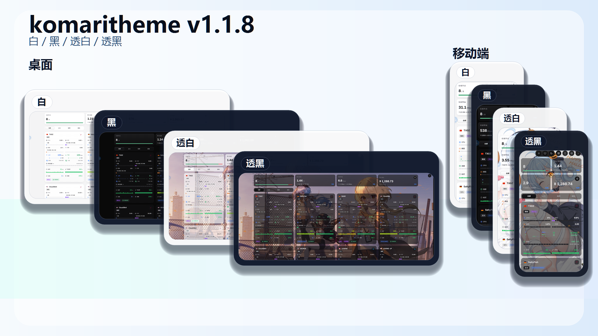

### 首页总览与节点卡片

首页总览新增文字评级，节点卡片同步优化流量额度、在线时长与布局密度；支持背景图与卡片透明度调节。

  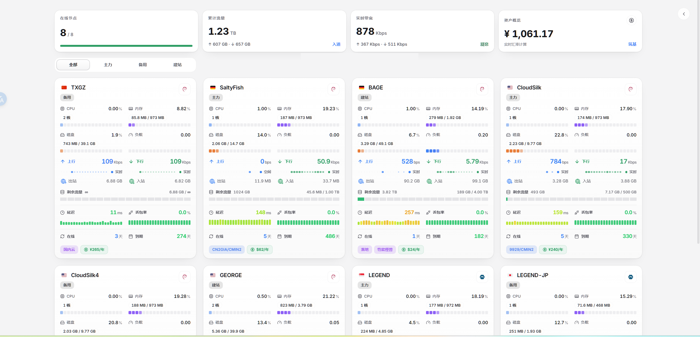

  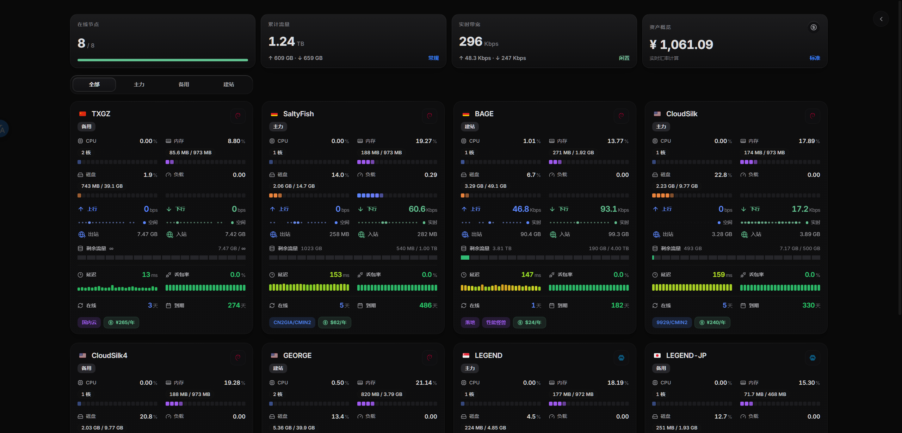

  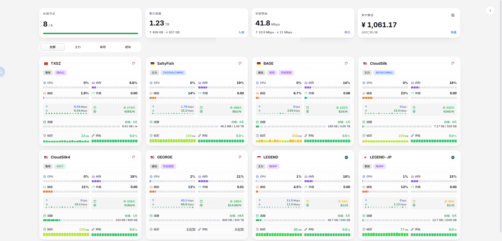

  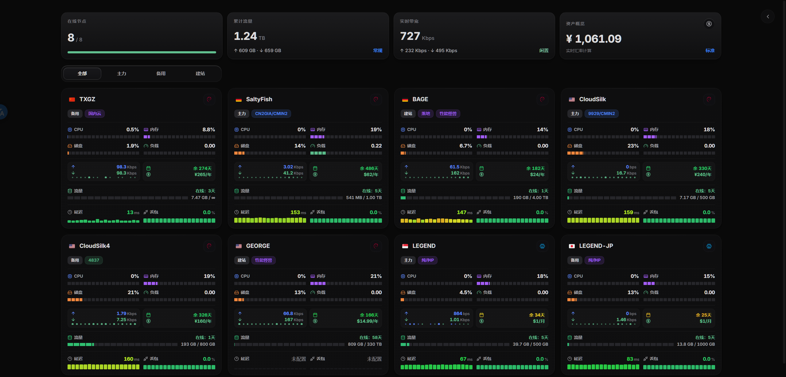

### 透明背景

背景图与卡片透明度可在主题管理中配置，支持大卡片、小卡片和移动端布局。

  

  

  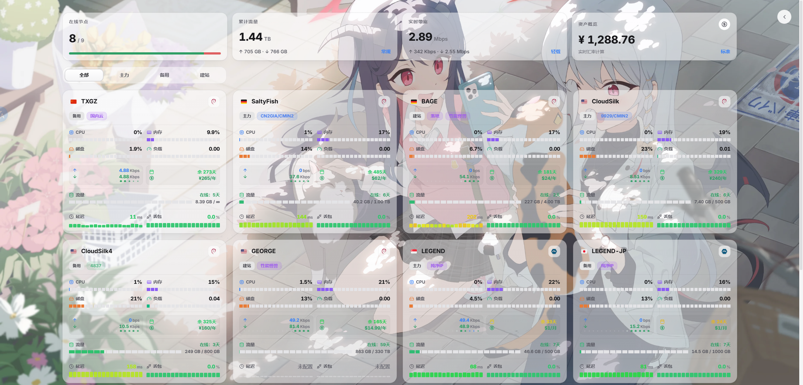

  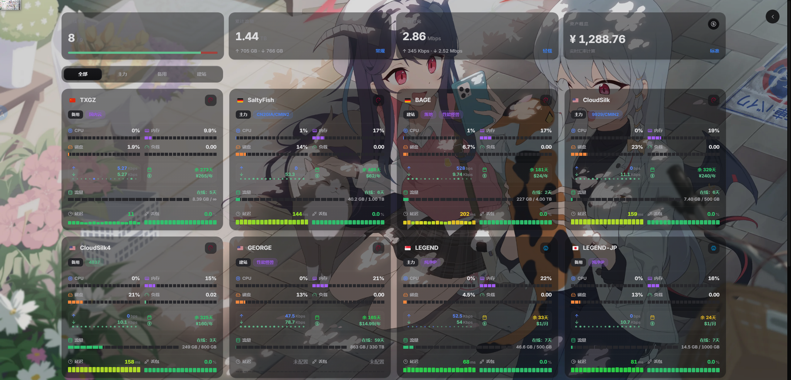

### 移动端

移动端总览卡片采用更紧凑的信息展示，保留评级和关键指标。

  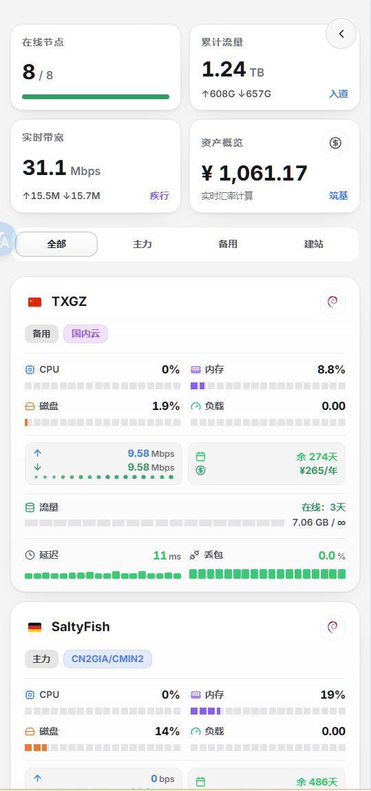

  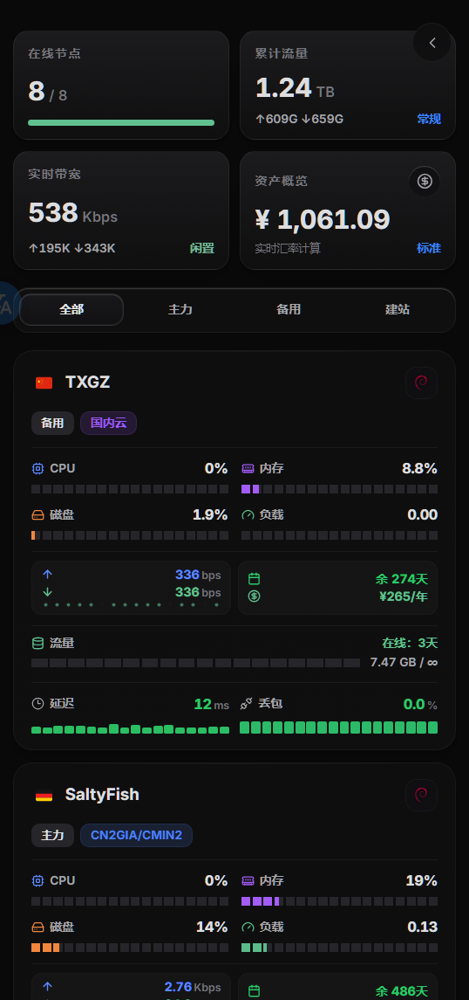

  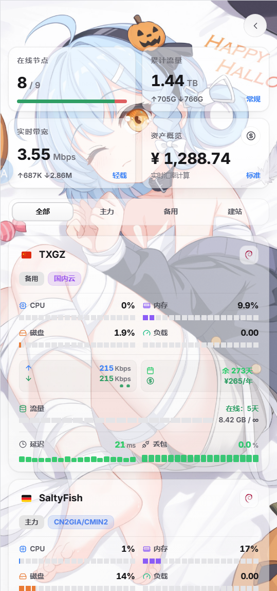

  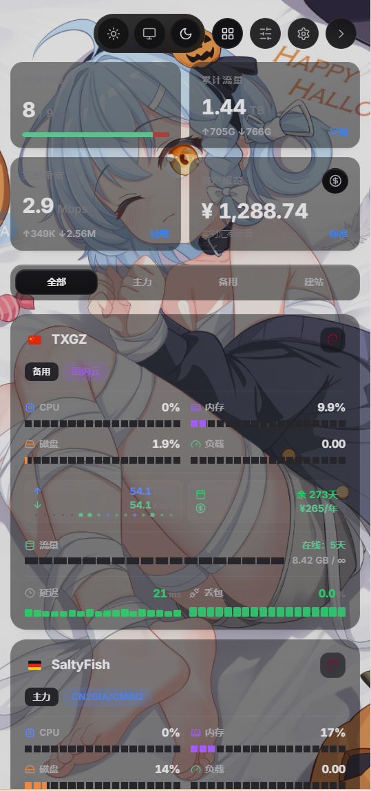

### 资产统计

资产统计界面重做，整合入口、指标、明细排序与汇率信息。

  

### 主题管理

主题管理新增总览评级配置，并加入小卡片在线时间、资产统计等显示项开关。

  

  

### 离线状态

离线节点保持清晰的状态提示，同时保留最近一次上报的关键指标。

  

## 致谢

特别感谢 [stqfdyr/komari-theme-Lumina](https://github.com/stqfdyr/komari-theme-Lumina)。

也感谢 Komari 官方主题、Mochi、PurCarte 等主题项目为 Komari 生态提供的设计和实现思路。

## 参考

- [Komari](https://github.com/komari-monitor/komari)
- [komari-theme-Lumina](https://github.com/stqfdyr/komari-theme-Lumina)
- [Komari 主题开发文档](https://komari-document.pages.dev/)

## Star History

<a href="https://www.star-history.com/#shanyang242/Theme&Date">
  <picture>
    <source media="(prefers-color-scheme: dark)" srcset="https://api.star-history.com/svg?repos=shanyang242/Theme&type=Date&theme=dark" />
    <source media="(prefers-color-scheme: light)" srcset="https://api.star-history.com/svg?repos=shanyang242/Theme&type=Date" />
    
  </picture>
</a>
